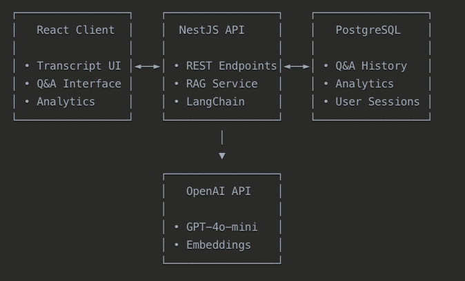
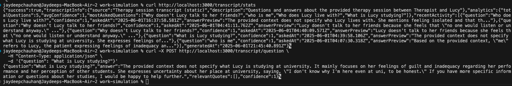
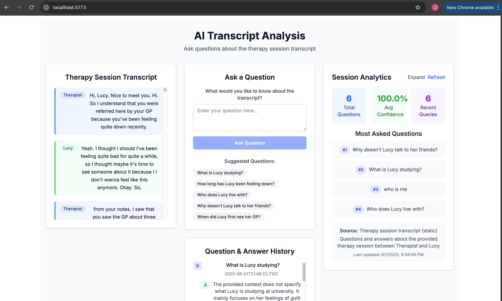
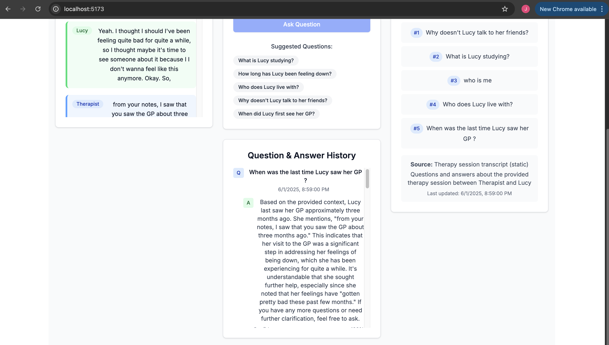

## AI Transcript Analysis System

A sophisticated AI-powered question-answering system for therapy session transcripts, built with LangChain RAG (Retrieval-Augmented Generation) and modern web technologies.

### 🎯 Overview

This system allows users to ask natural language questions about a therapy session transcript and receive intelligent, context-aware answers with relevant quotes and confidence scores. The AI agent uses advanced retrieval techniques to find relevant information and generates responses using GPT-4.

### ✨ Features

#### Core Functionality

- 🤖 Intelligent Q&A: AI agent that understands and answers questions about the transcript.
- 📝 Context-Aware Responses: Provides relevant quotes from the original conversation.
- 🎯 Confidence Scoring: Each response includes a confidence level (0-100%).
- 💬 Natural Language Processing: Handles complex questions about emotions, timeline, and relationships.

#### User Experience

- 📊 Real-time Analytics: Usage statistics, popular questions, and system performance metrics.
- 💾 Persistent History: All Q&A interactions saved to PostgreSQL database.
- 🔄 Auto-refresh: Analytics and history update automatically as you use the system.

## 🏗️ Architecture



## Setup Instructions

1. **Clone the repository**

   ```
   git clone https://github.com/Jd8111997/work-simulation/
   cd work-simulation
   ```
2. **Update OpenAI API Key in .env file in api**
   ```
   OPENAI_API_KEY=sk-your-actual-openai-api-key-here
   ```

3. **Start the backend api**
   ```
   docker compose up --build
   ```
4. **Start the frontend client**
   ```
   npm run dev
   ```
5. **Open the application**
   ```
   - Frontend: http://localhost:5173
   - API: http://localhost:3000
   ```

## 💡 Usage Examples

### Sample Questions to Try
- **Personal Information**: "What is Lucy studying?"
- **Timeline Questions**: "How long has Lucy been feeling down?"
- **Emotional State**: "How does Lucy describe her feelings?"
- **Relationships**: "What does Lucy say about her friends?"
- **Triggers**: "What caused Lucy's depression to start?"
- **Coping Mechanisms**: "How does Lucy deal with her emotions?"

## API Endpoints
| Method         | Endpoint                  | Description    |
|:----------------|:-------------------------------|------------:|
| `Get`     | `/transcript`            | Get the therapy session transcript        |
| `Post`    | `/transcript/question`     | Ask a question about the transcript      |
| `Get`     | `/transcript/stats`             | Get usage analytics and statistics   |
| `Get`     | `/transcript/history`          | Get Q&A history from the database  |

## Example API Usage
```
# Ask a question
curl -X POST http://localhost:3000/transcript/question \
  -H "Content-Type: application/json" \
  -d '{"question": "What is Lucy studying?"}'

# Get analytics
curl http://localhost:3000/transcript/stats
```
## Sample Output



## 🎨 Snippets of User Interface





## 📊 AI Implementation Details

### RAG (Retrieval-Augmented Generation) Pipeline

#### 1. Document Processing
- Parse therapy transcript into conversation turns
- Create document chunks with speaker metadata
- Generate conversation context windows for better understanding

#### 2. Embedding Generation
- Convert text chunks to vector embeddings using OpenAI's text-embedding-3-small model
- Store embeddings in memory vector store for fast retrieval

#### 3. Question Processing
- Generate embedding for user question
- Find most similar transcript chunks using cosine similarity
- Retrieve top 4 most relevant conversation segments

#### 4. Answer Generation
- Create context-aware prompt with retrieved segments
- Generate response using GPT-4o-mini
- Extract relevant quotes and calculate confidence score

## Key AI Features
- **Semantic Search**: Understands meaning, not just keywords
- **Context Preservation**: Maintains conversation flow and speaker context
- **Quote Attribution**: Identifies specific relevant excerpts
- **Confidence Scoring**: Provides reliability metrics for each response

## 📈 Analytics & Monitoring

### Database Schema
- **qa_history**: Stores all questions, answers, quotes, and confidence scores
- **Indexes**: Optimized for timestamp-based queries and analytics

### Metrics Tracked

- Total questions asked
- Average confidence score
- Most popular questions
- Recent activity with timestamps
- Processing time per question

## 🚀 Future Enhancements
Potential improvements for production deployment

### Core Infrasturcture
- **Authentication & Authorization**: Implement comprehensive user management with role-based access control, session security, and multi-tenant support
- **Vector Database Integration**: Replace ephemeral embedding generation with persistent vector storage using Pinecone, Weaviate, or Chroma to eliminate recomputation overhead and enable faster query responses
- **Scalable Architecture**: Containerization with Docker, horizontal scaling capabilities, and load balancing for production workloads

### AI & Analytics Capabilities
- **Multi-Session Analysis**: Support for analyzing multiple transcripts simultaneously with cross-session insights and comparative analytics
- **Dynamic Speaker Detection**: Automatically parse speaker names from transcript formatting, extract conversation context, and generate contextually relevant questions based on dialogue content rather than using hardcoded static transcripts
- **Enhanced RAG System**:
   - Experiment with state-of-the-art embedding models (e.g., OpenAI Ada-002, Sentence-BERT variants, domain-specific models)
   - Implement comprehensive benchmarking framework to evaluate accuracy, relevance, and truthfulness across diverse transcript types
   - Hybrid search combining semantic and keyword-based retrieval


